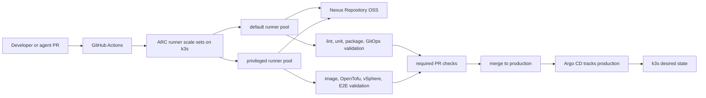
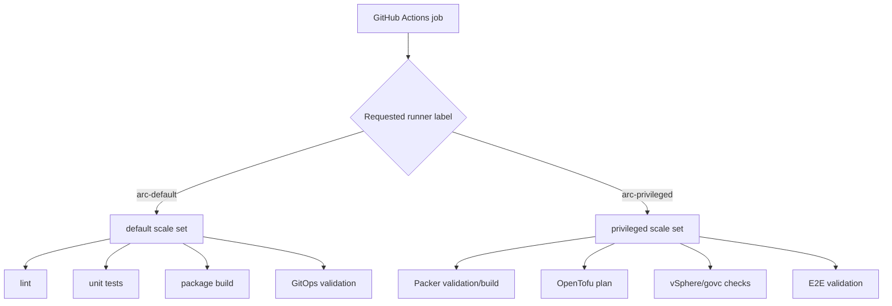
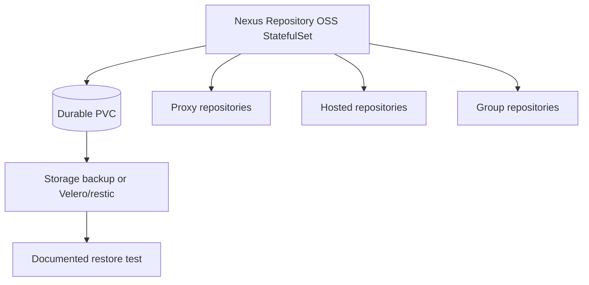
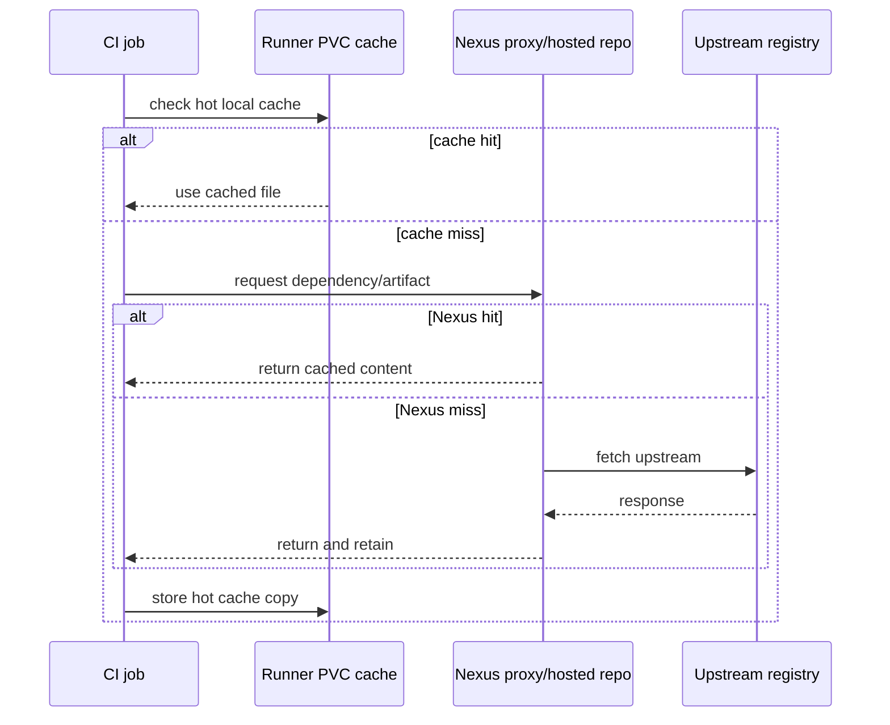
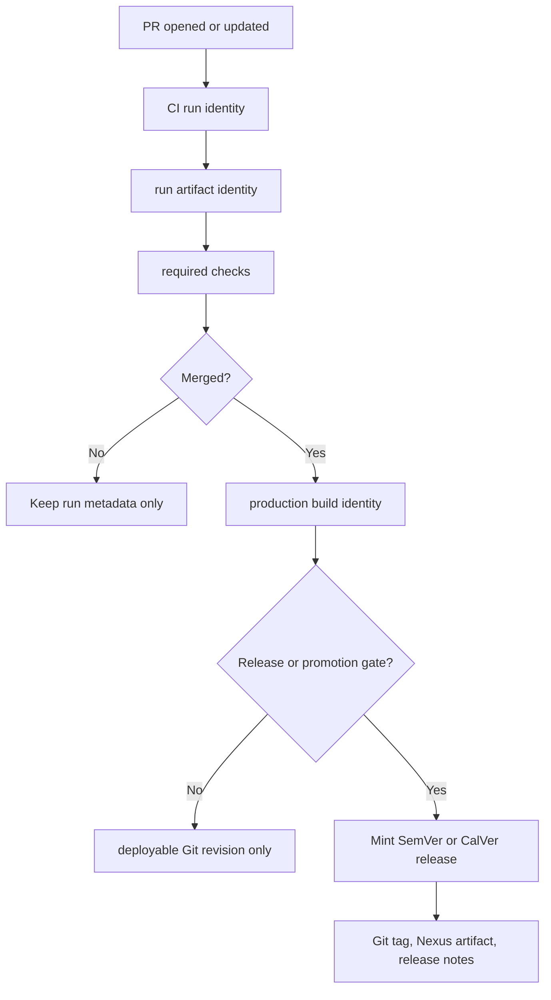
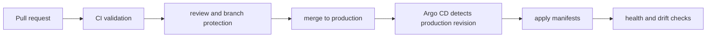
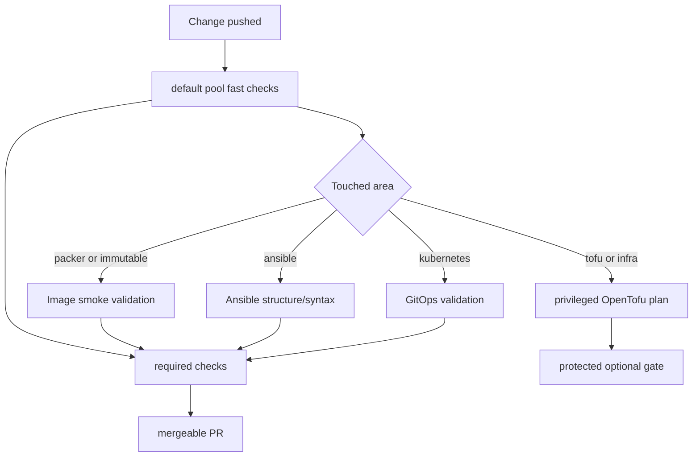

# ARC-First CI/CD Stack With Nexus On K3s

This document outlines an ARC-first CI/CD architecture for `homelab-gitops`.
The preferred path is GitHub Actions Runner Controller on k3s, Nexus Repository
OSS on k3s, layered caching, and GitOps-only promotion.

## Recommended Baseline

Use k3s as the CI/CD platform substrate and keep Git as the deployment gate.
GitHub Actions validates changes, Nexus caches and stores build inputs/outputs,
and Argo CD reconciles approved cluster state from the protected `production`
branch after merge/promotion.

Preferred defaults:

| Decision | Preferred Path | Why |
| :--- | :--- | :--- |
| Runner platform | ARC runner scale sets on k3s | Kubernetes-native autoscaling and isolation for CI jobs. |
| Runner pools | Two-tier pool: `default` and `privileged` | Keeps normal checks cheap while isolating infra-capable jobs. |
| Artifact/cache service | Nexus Repository OSS on k3s | One internal hub for proxy repositories and hosted artifacts. |
| Cache model | Layered cache | Nexus stores durable/proxy cache; runner PVCs speed hot local rebuilds. |
| CD promotion | GitOps-only | CI validates, Git records intent, Argo CD applies after merge. |
| Versioning | Run identity for every CI run; release version only at promotion gates | Preserves traceability without creating release noise for every PR. |

## Runner Pools

Deploy the ARC controller and two runner scale sets with Helm-managed GitOps
manifests. GitHub's ARC documentation recommends Helm for runner scale sets, so
the GitOps app should own Helm release values rather than hand-written controller
objects.

### `default` Scale Set

Use this for jobs that do not need direct infrastructure access:

- Python lint, unit tests, and packaging.
- YAML, Ansible, and shell lint.
- GitOps manifest rendering.
- Image input smoke validation when Packer and Butane can run without vSphere.
- Documentation and metadata validation.

Recommended constraints:

- No privileged containers.
- No direct vCenter/OpenTofu production credentials.
- Read-only GitHub token permissions by default.
- Access to Nexus proxy repositories.
- Optional small PVC cache for pip, npm, pytest, and pre-commit style caches.

### `privileged` Scale Set

Use this only for jobs that need more trust or network reach:

- Packer image builds.
- vSphere/govc validation.
- OpenTofu plans against real infrastructure.
- Integration and E2E jobs that touch homelab services.
- Any job requiring Docker-in-Docker or elevated container capabilities.

Recommended constraints:

- Explicit workflow label such as `runs-on: arc-privileged`.
- Dedicated Kubernetes namespace or strong NetworkPolicy boundaries.
- Credentials sourced from External Secrets/OpenBao.
- Larger PVC cache for Packer plugins, OpenTofu providers, and image build
  scratch space.
- Manual or branch-protected triggers for mutating infra jobs.

Keep the existing VM runner model as a transition fallback for workflows that
cannot safely run in ARC yet. It should not remain the default target once ARC is
stable.

## Nexus On K3s

Run Nexus Repository OSS as a GitOps-managed platform app on k3s. Treat it as a
stateful single-instance service, not an HA system.

Repository layout:

| Repository | Type | Purpose |
| :--- | :--- | :--- |
| `pypi-proxy` | proxy | Cache Python dependencies from PyPI. |
| `npm-proxy` | proxy | Cache npm dependencies. |
| `docker-proxy` | proxy | Cache public container images where Nexus format support fits. |
| `helm-proxy` | proxy | Cache upstream Helm charts used by ARC, cert-manager, Argo CD, and platform apps. |
| `homelab-python` | hosted | Publish internal Python wheels/sdists if needed. |
| `homelab-helm` | hosted | Publish internal Helm charts if this repo later packages charts. |
| `homelab-raw` | hosted | Store generic artifacts such as validated manifests, Packer manifests, or release bundles. |

Operational requirements:

- Durable PVC sized for dependency cache growth.
- Backup schedule before enabling Nexus as a required CI dependency.
- Restore runbook that proves a fresh Nexus pod can recover repositories.
- Resource limits high enough for Java/Nexus startup and cache compaction.
- Internal DNS name such as `nexus.infra.plexplease.com`.
- TLS via cert-manager.
- Secrets via External Secrets backed by OpenBao.

Upgrade path:

- Start with Nexus Repository OSS single-instance on k3s.
- If artifact availability becomes critical, evaluate Nexus Repository Pro/HA
  with external PostgreSQL and the supported HA/resilient chart model.
- Alternatives to reassess before HA investment: Harbor for container registry,
  GitHub Packages for GitHub-native artifacts, Forgejo/Gitea packages for
  lightweight self-hosting, or a dedicated VM-based Nexus instance.

## Layered Cache Model

Nexus is the long-lived cache and artifact source. Runner PVCs are short-lived
accelerators. Do not let runner PVCs become the only copy of an artifact.

Cache ownership:

| Layer | Owns | Persistence | Recovery expectation |
| :--- | :--- | :--- | :--- |
| Nexus | Proxied dependencies, hosted release artifacts, durable build outputs | Durable PVC and backup | Must be restorable. |
| Runner PVC | pip/npm/test/Packer/OpenTofu hot caches | Reusable but disposable | Can be deleted and rebuilt. |
| GitHub Actions cache | Optional cache for GitHub-hosted fallback jobs | GitHub-managed | Convenience only. |
| Build workspace | Checked-out repo and temporary outputs | Ephemeral | Deleted after job. |

## Versioning And Promotion Gates

Every CI run should have an immutable identity, but not every PR should receive
a release version.

Recommended identities:

| Event | Identity | Creates Git tag? | Creates release version? |
| :--- | :--- | :--- | :--- |
| PR run | `pr-<number>-run-<run_number>-<short_sha>` | No | No |
| Merge run | `production-<run_number>-<short_sha>` | No | No |
| Release candidate | `vX.Y.Z-rc.N` or `YYYY.MM.DD-rc.N` | Optional | Yes, gated |
| Release/promotion | `vX.Y.Z` or `YYYY.MM.DD.N` | Yes | Yes |

Version gate recommendation:

- PRs produce traceable artifacts and reports using run identity only.
- Merges produce deployable Git revisions, not release versions by default.
- A manual `release` or `promote` workflow mints the version, tags Git, writes
  release notes, and publishes any release artifacts to Nexus.
- Kubernetes deployments promote by Git revision through Argo CD. Image or chart
  version bumps happen in Git and are reviewed like any other change.

This keeps the audit trail precise without creating a new SemVer or CalVer
number for every PR.

## GitOps-Only Promotion

CI should validate and publish supporting artifacts, but not directly mutate the
live cluster's desired state outside Git.

Rules:

- PR checks render manifests and validate schemas locally.
- CI may publish non-deploying artifacts such as coverage, wheel builds, Packer
  manifests, or validation reports.
- Deployment intent is represented by Git changes under `kubernetes/`.
- Argo CD owns cluster reconciliation.
- Emergency break-glass actions must be documented separately and reconciled back
  into Git afterward.

## Pipeline Shape

Recommended required PR checks:

1. Lint: YAML, Python, Ansible, shell.
2. Unit tests and package build/install smoke test.
3. GitOps manifest validation.
4. Ansible structure validation.
5. Image build input smoke validation.

Optional or gated checks:

- OpenTofu plan on `arc-privileged`.
- Packer image build on `arc-privileged`.
- Integration tests against vSphere/test VMs.
- E2E lifecycle validation.

## Alternatives

| Area | Alternative | Tradeoff |
| :--- | :--- | :--- |
| Runner platform | Existing VM runners | Simple and already available, but less elastic and harder to isolate per job type. |
| Runner platform | GitHub-hosted runners plus VPN | Low local maintenance, but network and secret exposure are harder to control. |
| Artifact service | Nexus on VM | Better storage isolation, less Kubernetes-native management. |
| Artifact service | Harbor | Strong container registry story, weaker general package repository coverage than Nexus. |
| Artifact service | GitHub Packages | Less infrastructure to run, tighter GitHub coupling and less LAN-cache control. |
| Cache model | Nexus-only | Simpler, but slower hot rebuilds for heavy tools. |
| Cache model | PVC-only | Fast locally, but poor durability and no shared artifact governance. |
| CD model | CI-triggered deploys | Faster direct execution, but couples GitHub credentials to infrastructure mutation. |
| CD model | Hybrid deploys | Pragmatic for transition, but easy to accumulate unclear ownership. |

## Migration Phases

1. **Design and bootstrap**
   - Add ARC and Nexus as platform app definitions.
   - Store GitHub app/token and Nexus admin/bootstrap secrets in OpenBao.
   - Define DNS and TLS names.
2. **Default runner pool**
   - Move lint, unit, package, GitOps, Ansible, and image smoke checks to
     `arc-default`.
   - Configure Nexus proxy usage for pip/npm/Helm/container pulls.
3. **Privileged runner pool**
   - Add network policy and secrets for vSphere, OpenTofu, Packer, and E2E jobs.
   - Move infra-sensitive workflows behind labels, manual triggers, or branch
     protection.
4. **Nexus hardening**
   - Add backup/restore validation.
   - Add repository cleanup policies and storage alerts.
   - Document restore tests.
5. **Release and promotion**
   - Add a gated release workflow that mints SemVer or CalVer only when promoted.
   - Publish release artifacts and manifests to Nexus.
   - Keep Argo CD as the deployment authority.

## References

- GitHub Actions Runner Controller documentation:
  <https://docs.github.com/en/actions/concepts/runners/actions-runner-controller>
- GitHub ARC runner scale set deployment documentation:
  <https://docs.github.com/en/actions/how-tos/manage-runners/use-actions-runner-controller/deploy-runner-scale-sets>
- Actions Runner Controller project:
  <https://github.com/actions/actions-runner-controller>
- Sonatype Nexus Repository Helm repository support:
  <https://help.sonatype.com/en/helm-repositories.html>
- Sonatype Nexus Repository Manager Helm chart repository:
  <https://github.com/sonatype/nxrm3-helm-repository>
