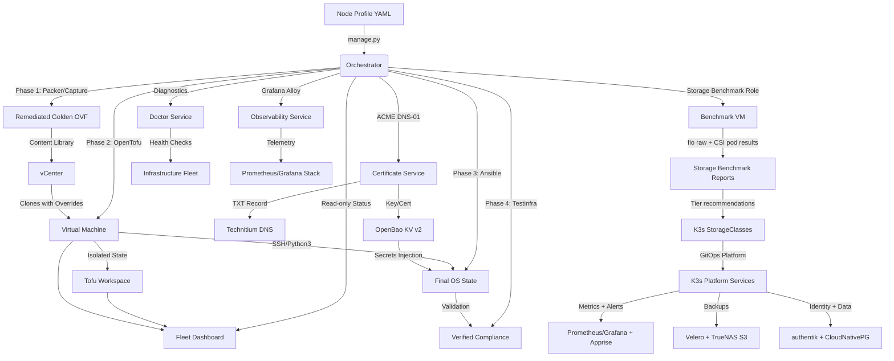

# Pipeline Architecture & Design

High-level design and technical principles for the synthesized GitOps pipeline.

## 1. High-Level Workflow

The pipeline utilizes a tiered "Build-Provision-Configure" model to ensure consistent, secure deployments across diverse OS distributions.

---

## 2. Python Module Boundary Plan

The Python package is moving toward explicit module ownership before any broad
file moves occur. Until that refactor begins, new code should follow these
target boundaries and avoid adding new cross-layer shortcuts.

| Target area | Intended ownership |
| :--- | :--- |
| `cli` | Typer/Rich command surfaces, prompt flow, argument parsing, presentation, and translation of user input into application calls. CLI modules should not own deployment policy or provider API details. |
| `core` | Shared domain models, validation, state transitions, errors, configuration loading, and pure orchestration primitives that do not call external systems directly. |
| `workflows` | Lifecycle sequencing for build, deploy, config, test, status, certificates, migration, backup, and observability. Workflows coordinate core models and provider interfaces, but should not embed provider-specific API behavior. |
| `providers` | Concrete adapters for external systems such as vCenter, OpenTofu, Ansible, Packer, Technitium, OPNsense, ACME, OpenBao, and 1Password. Providers own subprocess calls, SDK/API clients, retries, credential handoff, and provider-specific error translation. |
| `immutable/images` | Image-build and immutable OS concerns, including Packer image flows, Butane/Talos transpilation, ignition or machine-config generation, and immutable deployment verification. |
| GitOps helpers | Repository-shaping utilities such as profile, role, playbook, metadata, documentation, and scaffold generators. These helpers should update source-of-truth files without reaching into provider clients. |

The current code still has direct domain-to-driver coupling in several services
and workflows. For example, domain modules construct or import concrete drivers
for vCenter, OpenTofu, Ansible, Technitium, OPNsense, secrets, and immutable
verification. That coupling is an explicit cleanup target: future refactors
should introduce provider interfaces or factories at workflow boundaries so
core/domain logic depends on capabilities, not concrete drivers.

Minimal provider adapter responsibilities, read-only methods, mutating methods,
and workflow injection guidance are defined in
[Provider Adapter Boundaries](./PROVIDER_ADAPTERS.md).
The target source-versus-generated layout for Packer, Butane, Ignition, and
installer HTTP payloads is defined in
[Image Build Source And Artifact Layout](./IMAGE_BUILD_LAYOUT.md).
The target ARC-first CI/CD stack with Nexus-on-k3s, layered cache ownership,
runner pool separation, and version gates is documented in
[ARC-First CI/CD Stack With Nexus On K3s](./ARC_NEXUS_CICD_STACK.md).

This note is a boundary plan only. It does not require broad file moves by
itself; moves should happen incrementally with tests and compatibility shims
when implementation work begins.

---

## 3. Infrastructure Standards

### Golden Image Remediation
To prevent deployment conflicts and ensure maximum performance, all images in the `GOLDEN` content library are standardized with:
*   **SCSI Controller:** VMware Paravirtual (**PVSCSI**).
*   **Network Adapter:** **VMXNET3**.
*   **Compatibility:** Hardware Version **21** (vmx-21).
*   **OS Hardening:** Root login disabled, password authentication disabled, SSH keys pre-injected.

### State Isolation (OpenTofu)
We use **Tofu Workspaces** to achieve granular state management. Each virtual machine has its own state file, allowing for:
*   **Independent Lifecycle:** Destroy or update one VM without impacting the rest of the fleet.
*   **Drift Detection:** Tofu compares the real VM hardware against the profile YAML during every run.

---

## 4. Dynamic Configuration (Ansible)

Instead of maintaining static hostnames in an inventory file, Ansible queries vCenter in real-time.
*   **Tag-Based Routing:** Ansible groups VMs based on vSphere Tags (e.g., `tag_photon`, `tag_docker`).
*   **Automated Role Mapping:** The master playbook (`site.yml`) automatically applies relevant roles based on these discovered tags.
*   **Role Ownership:** Role and playbook ownership categories are documented in [Ansible Role and Playbook Ownership](./ANSIBLE_ORGANIZATION.md).

## 4. Kubernetes GitOps Layout

Kubernetes manifests follow the target directory model documented in
[GitOps Layout Standard](./GITOPS_LAYOUT.md). The standard separates cluster
composition, platform apps, workload apps, and bootstrap/root apps so ownership
and sync responsibility remain clear as more clusters and services are added.

The k3s-01 cluster composes democratic-csi platform overlays and storage tier
overlays from `kubernetes/platform/`. Storage tiers begin as skeleton
StorageClasses (`storage-fast`, `storage-standard`, and `storage-bulk`) and are
updated after benchmark results identify the best backend/protocol mapping.

The k3s-01 platform baseline also composes backup, observability,
notifications, database, identity, and sample workload overlays. Velero stores
cluster backups in the TrueNAS S3/MinIO target; kube-prometheus-stack provides
Prometheus, Alertmanager, and Grafana; Loki stores Kubernetes logs on a
`storage-standard` PVC; Grafana Alloy forwards pod logs and Kubernetes events
to Loki; Alertmanager sends notifications through Apprise, whose first
configured destination is `ntfy`; CloudNativePG owns the platform PostgreSQL
primitive used by authentik.

The live GitOps promotion branch is `production`. The k3s-01 Argo CD root
Application pins `targetRevision: production` so live reconciliation is explicit
and does not depend on the repository's default branch pointer. During branch
migration, `master` may remain as an integration compatibility branch, but live
cluster desired state should be promoted by updating `production`.

---

## 5. Operational Excellence

*   **Idempotency:** Every layer (Tofu, Ansible) is designed to be re-run safely. If the desired state is already reached, no changes are made.
*   **Fail-Fast Validation:** Pre-deployment linting and post-deployment connectivity tests prevent wasting time on malformed configs or network issues.
*   **No-Deploy Image Smoke Validation:** Packer templates and Butane transpilation inputs can be validated with `python3 scripts/validate_image_build_inputs.py` before any image build or infrastructure deployment begins.
*   **Comprehensive Testing:** Final verification is performed by **Pytest-Testinfra**, ensuring the node is truly "Ready for Production" before the pipeline finishes.
*   **Centralized Secrets:** Runtime secret references use `bao://` URIs in `config/secrets.env` and resolve from OpenBao KV v2. 1Password is retained only as a legacy migration source.
*   **Read-Only Fleet Visibility:** `python3 manage.py status` compares managed Tofu workspaces with vCenter VM facts so operators can see power state, IP, host placement, profile tags, and likely workspace drift before making lifecycle changes.
*   **Profile-Owned Retention:** The `log_retention` role is assigned to profile playbooks and consumes profile `logging:` policy. Generic journald retention is bounded globally; application file rotation is declared by the profile that owns the application path.
*   **Measured Storage Tiers:** The `storage_benchmark` role produces raw protocol and k3s CSI-path fio reports before storage tier defaults are finalized.
*   **Workload Readiness Gate:** k3s workloads should use the sample workload template and declare DNS, ingress, SSO, storage, secret, backup, alert, and restore expectations before being added to the cluster composition.

## Runner Storage

Runner profiles define 400 GB disks and pass that size to OpenTofu as
`disk_size_gb`. The runner Ansible baseline (`github_runner_base`) grows the
guest root partition and filesystem so the OS consumes the full virtual disk.
Existing registered runners can be repaired with `ansible/runner-maintenance.yml`
without using a GitHub registration token.

Future CI/CD runner work should prefer the ARC-first model documented in
[ARC-First CI/CD Stack With Nexus On K3s](./ARC_NEXUS_CICD_STACK.md). The
existing VM runner model remains a migration fallback for jobs that cannot yet
run safely on k3s runner scale sets.
