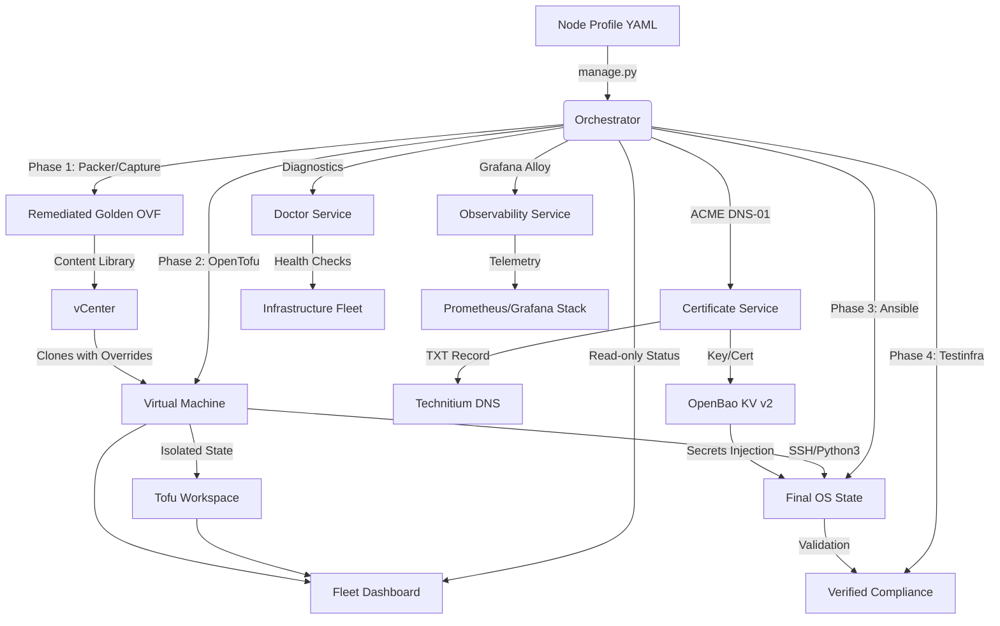

# Pipeline Architecture & Design

High-level design and technical principles for the synthesized GitOps pipeline.

## 1. High-Level Workflow

The pipeline utilizes a tiered "Build-Provision-Configure" model to ensure consistent, secure deployments across diverse OS distributions.

---

## 2. Infrastructure Standards

### Golden Image Remediation
To prevent deployment conflicts and ensure maximum performance, all images in the `GOLDEN` content library are standardized with:
*   **SCSI Controller:** VMware Paravirtual (**PVSCSI**).
*   **Network Adapter:** **VMXNET3**.
*   **Compatibility:** Hardware Version **21** (vmx-21).
*   **OS Hardening:** Root login disabled, password authentication disabled, SSH keys pre-injected.

### State Isolation (OpenTofu)
We use **Tofu Workspaces** to achieve granular state management. Each virtual machine has its own state file, allowing for:
*   **Independent Lifecycle:** Destroy or update one VM without impacting the rest of the fleet.
*   **Drift Detection:** Tofu compares the real VM hardware against the profile YAML during every run.

---

## 3. Dynamic Configuration (Ansible)

Instead of maintaining static hostnames in an inventory file, Ansible queries vCenter in real-time.
*   **Tag-Based Routing:** Ansible groups VMs based on vSphere Tags (e.g., `tag_photon`, `tag_docker`).
*   **Automated Role Mapping:** The master playbook (`site.yml`) automatically applies relevant roles based on these discovered tags.
*   **Role Ownership:** Role and playbook ownership categories are documented in [Ansible Role and Playbook Ownership](./ANSIBLE_ORGANIZATION.md).

---

## 4. Operational Excellence

*   **Idempotency:** Every layer (Tofu, Ansible) is designed to be re-run safely. If the desired state is already reached, no changes are made.
*   **Fail-Fast Validation:** Pre-deployment linting and post-deployment connectivity tests prevent wasting time on malformed configs or network issues.
*   **Comprehensive Testing:** Final verification is performed by **Pytest-Testinfra**, ensuring the node is truly "Ready for Production" before the pipeline finishes.
*   **Centralized Secrets:** Runtime secret references use `bao://` URIs in `config/secrets.env` and resolve from OpenBao KV v2. 1Password is retained only as a legacy migration source.
*   **Read-Only Fleet Visibility:** `python3 manage.py status` compares managed Tofu workspaces with vCenter VM facts so operators can see power state, IP, host placement, profile tags, and likely workspace drift before making lifecycle changes.
*   **Profile-Owned Retention:** The `log_retention` role is assigned to profile playbooks and consumes profile `logging:` policy. Generic journald retention is bounded globally; application file rotation is declared by the profile that owns the application path.

## Runner Storage

Runner profiles define 400 GB disks and pass that size to OpenTofu as
`disk_size_gb`. The runner Ansible baseline (`github_runner_base`) grows the
guest root partition and filesystem so the OS consumes the full virtual disk.
Existing registered runners can be repaired with `ansible/runner-maintenance.yml`
without using a GitHub registration token.
