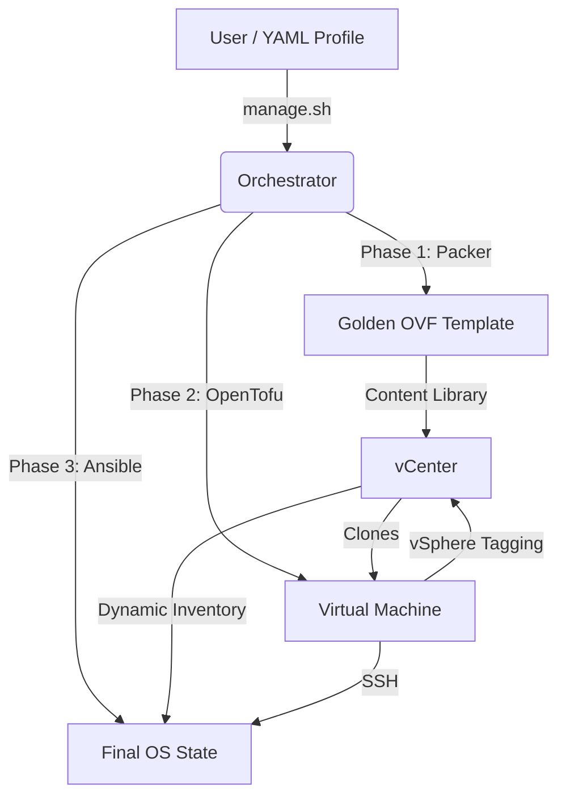

# Pipeline Architecture & Design

This document describes the high-level design of the synthesized GitOps pipeline for Ubuntu and Photon OS environments.

## 1. High-Level Workflow

The pipeline is divided into three distinct functional layers: **Build**, **Provision**, and **Configure**.



---

## 2. Component Design

### A. Golden Image Creation (Packer)
We utilize a **Golden Image** strategy to ensure that all virtual machines start from a pre-hardened and pre-configured baseline.
*   **Source:** Official ISOs or OVAs.
*   **Customization:** Shell scripts install mandatory packages (Python 3, Open-VM-Tools, Sudo) and apply SSH hardening.
*   **Output:** The final image is exported to the vCenter Content Library. This drastically reduces deployment times by avoiding the OS installation phase for each new VM.

### B. Declarative Provisioning (OpenTofu)
Infrastructure is managed as code using OpenTofu. 
*   **Workspaces:** We use **Tofu Workspaces** to achieve state isolation. Each virtual machine has its own `.tfstate` file, allowing us to update or destroy a single node without affecting the rest of the fleet.
*   **vSphere Tags:** Tofu is responsible for attaching metadata (tags) to the virtual machines. These tags (e.g., `photon`, `ubuntu`, `docker`) serve as the primary routing mechanism for Ansible.

### C. Configuration & State Enforcement (Ansible)
Ansible handles the "last-mile" configuration and ongoing maintenance.
*   **Dynamic Inventory:** Instead of a static `inventory.ini`, Ansible queries the vCenter API in real-time. It groups hosts into `tag_<tagname>` categories.
*   **OS Awareness:** The master playbook (`site.yml`) uses these groups to apply OS-specific logic (e.g., `tdnf` for Photon nodes, `apt` for Ubuntu nodes).

---

## 3. Configuration Hierarchy

All settings are centralized in the `config/` directory:

1.  **`config/secrets.env`**: Stores sensitive global connection details (vCenter URL, Credentials).
2.  **`config/profiles/*.yml`**: Defines the "personality" of a node.
    ```yaml
    vcenter:
      network: "VM Network"
    content_library:
      template: "photon-5.0-golden"
    vm_specs:
      cpu: 4
      ram_gb: 8
    deployment:
      tags: ["photon", "docker"]
    ```

---

## 4. Design Principles

*   **Idempotency:** Every script and playbook is designed to be run multiple times. If the desired state is already reached, no changes are made.
*   **Speed:** By leveraging Content Library templates and pre-flight linting, the time from "zero to shell" is minimized.
*   **Consistency:** Standardized YAML profiles ensure that every node in a group is identical to its peers.
