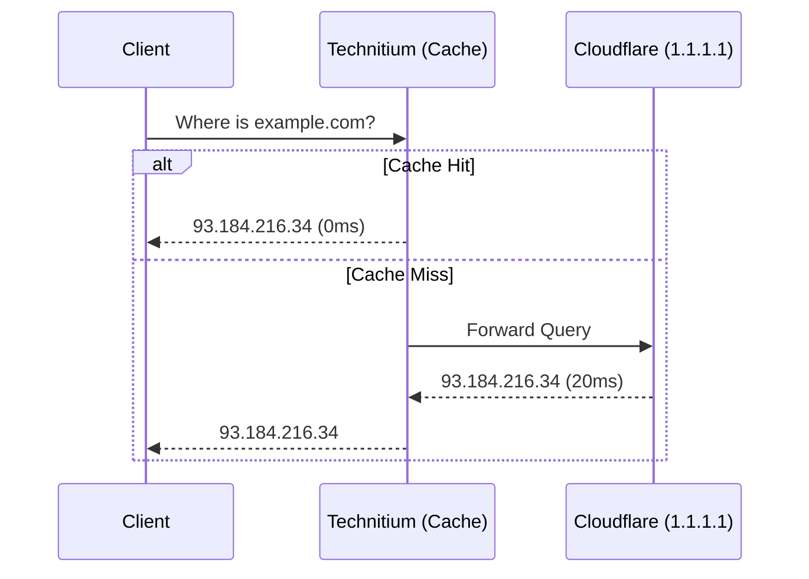
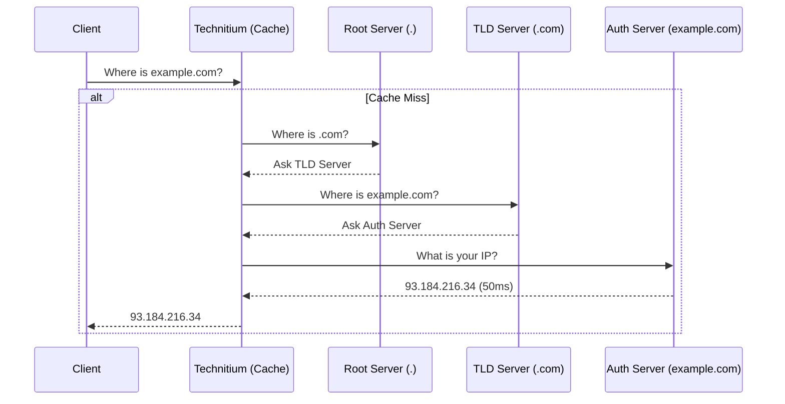

# Technitium DNS: Resolution & Caching Strategies

## Overview
This document explores the architectural choices for DNS resolution in a home lab or enterprise environment. It breaks down the differences between Recursive Resolution (Root Hints) and Forwarding, details advanced caching and prefetching strategies, and presents empirical benchmark data to guide architectural decisions.

## 1. Resolution Methods: Forwarding vs. Recursive

### Method A: Forwarding (The Messenger)
In a forwarding setup, your DNS server acts as a middleman. It receives a query, checks its local cache, and if missing, forwards the query to a large public resolver (e.g., Cloudflare `1.1.1.1` or Google `8.8.8.8`).

**Tradeoffs:**
*   **Pros:** Extremely fast cold lookups because you benefit from the public resolver's massive global cache.
*   **Cons:** Privacy is reduced, as the public resolver sees all your traffic.

### Method B: Recursive Resolution (Root Hints)
In a recursive setup, your server is the investigator. It queries the Internet's Root Servers, traces the delegation path to the TLD servers, and finally to the authoritative name server.

**Tradeoffs:**
*   **Pros:** Maximum privacy. No single third party sees your entire browsing history.
*   **Cons:** Slower cold lookups (Cache Misses) because your server has to perform 3-4 round trips across the internet.

---

## 2. Empirical Benchmarking: Latency Analysis

We developed a benchmark suite (`scripts/benchmark_dns.py`) targeting the top 25 global domains. The test measured the average response time for a **Cold Cache** (first request) and a **Warm Cache** (subsequent requests) in both Forwarding and Recursive modes.

### Test Environment
*   **Server:** Technitium DNS (v15.1) on VMware Photon OS
*   **Forwarder:** `1.1.1.1` and `8.8.8.8` (Concurrent)

### Results

| Resolution Mode | Cache State | Average Latency |
| :--- | :--- | :--- |
| **Forwarding (Cloudflare)** | **Cold** | **21.12 ms** |
| **Recursive (Root Hints)** | **Cold** | **47.64 ms** |
| **Forwarding (Cloudflare)** | **Warm** | **0.00 ms** |
| **Recursive (Root Hints)** | **Warm** | **0.04 ms** |

**Conclusion:** 
Forwarding is roughly **2x faster** on a cold cache lookup because Cloudflare already has the answer. However, once the record is in your local Technitium cache (Warm), both methods deliver identical **instantaneous (0ms) performance**. 

Because Warm cache performance is identical, the goal of a high-performance DNS server is to **keep the cache warm at all times**.

---

## 3. The "Always Hot" Caching Strategy

To mask the 47ms latency penalty of Recursive resolution, we employ aggressive prefetching and stale-serving tactics.

### Core Settings Defined
*   **`cacheMaximumEntries` (100,000)**: The physical size of the RAM parking lot. At 100k entries, Technitium consumes ~250MB of RAM.
*   **`cachePrefetchTrigger` (20s)**: If a record has less than 20 seconds left on its TTL, a user request will trigger a background refresh.
*   **`cachePrefetchEligibility` (60s)**: Ignores records with very low TTLs (like load balancers) to prevent spamming the network.
*   **`serveStaleTtl` (259,200s / 3 Days)**: If a record expires because you haven't used it, keep it "frozen" in RAM for 3 days.

### The Popularity Engine
Technitium's auto-prefetching engine relies on a "hits per hour" metric.
*   **`cachePrefetchSampleEligibilityHitsPerHour` (1)**: By setting this to 1, *any* domain requested just once in an hour is marked as "Popular" and is proactively refreshed in the background forever.

### The "Smart Heartbeat" Architecture
To keep records "Popular" even while you sleep, we deployed a systemd-driven Python script (`dns_heartbeat.py`) that runs every 45 minutes.

1.  **Crawl:** It queries the Technitium API and recursively crawls the cache hierarchy.
2.  **Evaluate:** It checks the remaining TTL of every record.
3.  **Trigger:** If a TTL is in the "Danger Zone" (< 10 minutes), it performs a local `dig` lookup.
4.  **Result:** Technitium registers a "hit," maintaining the domain's Popularity score, and triggering an active background refresh.

This completely eliminates Cold Cache latency for any domain you visit regularly.

---

## 4. Security & Hardening Settings

When running a local DNS server, security is paramount.

1.  **Recursion Access Control (`recursion: AllowOnlyForPrivateNetworks`)**: 
    Never allow Open Recursion on the public internet. This prevents your server from being used in DNS Amplification DDoS attacks.
2.  **DNSSEC Validation (`dnssecValidation: true`)**:
    Ensures that the responses you get from Root/Auth servers haven't been tampered with or poisoned.
3.  **QNAME Minimization (`qnameMinimization: true`)**:
    Improves privacy. When querying the `.com` server for `sub.example.com`, Technitium only asks for `example.com`, hiding the full subdomain from the TLD servers.
4.  **Local Firewalling (UFW / iptables)**:
    Only open ports `53/UDP/TCP` and `5380/TCP` (Management) to internal subnets.

## Summary

By combining **Recursive Resolution** (for maximum privacy) with **Smart Heartbeat Prefetching** (to eliminate cold cache latency), we achieve a DNS architecture that provides 0ms responses without surrendering browsing history to third-party forwarders.