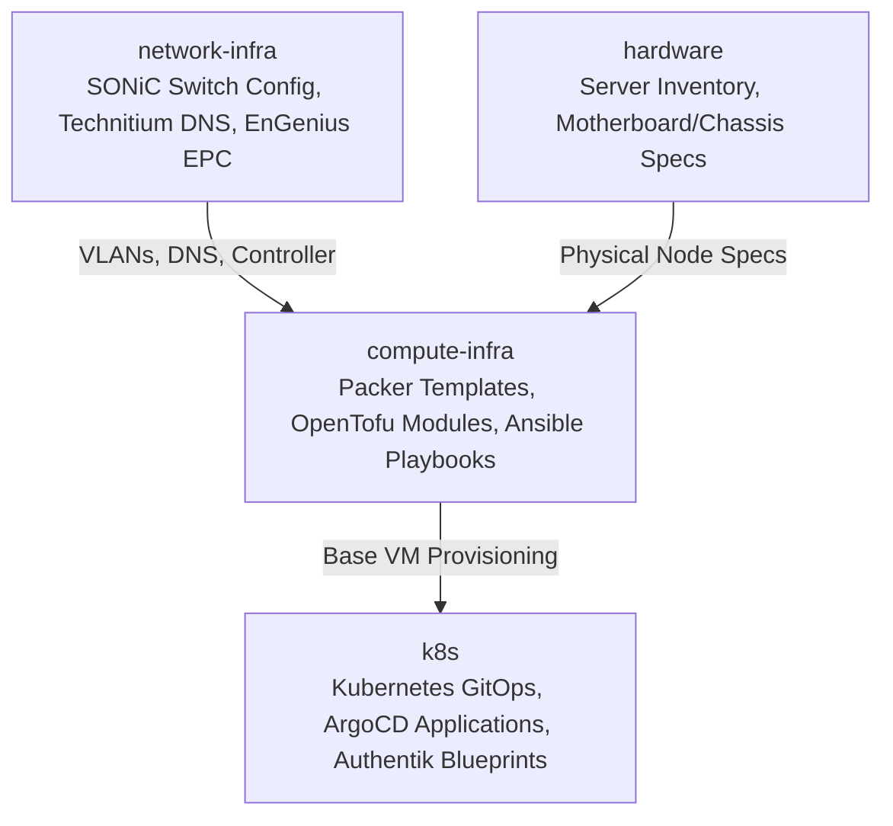

# Infrastructure Architecture & Repository Decomposition

## Overview

Following the infrastructure refactoring of 2026-09-03, this monolithic repository (`homelab-gitops`) has been decomposed into three focused repositories aligned with physical and operational lifecycles:



## Repository Roles

1. **`compute-infra` (`/home/dev/repos/compute-infra`)**:
   - **Packer**: Builds hardened Ubuntu and VMware Photon OS golden images.
   - **OpenTofu**: Declares virtual machine configurations across Proxmox / vSphere.
   - **Ansible**: Manages post-boot OS hardening, UFW firewall, Docker runtimes, and Grafana Alloy monitoring agents.

2. **`network-infra` (`/home/dev/repos/network-infra`)**:
   - **Enterprise SONiC**: Dell PowerSwitch N3224T-ON configuration files, VLAN segmentation, and port channel management.
   - **Technitium DNS & DHCP**: Declarative DNS zone management, forwarding rules, and client lease mappings.
   - **EnGenius EPC**: Controller configuration and containerized appliance lifecycle.

3. **`k8s` (`/home/dev/repos/k8s`)**:
   - Manages Kubernetes cluster resources via ArgoCD GitOps.
   - Authentik SSO and forward-auth configurations.
   - Core platform services (Prometheus Stack, Cert-Manager, External-Secrets, Rook-Ceph).

## Estate Catalog Integrity (`scripts/catalog_lint.py`)

`config/estate_inventory.yaml` is the authoritative, hand-maintained record of the estate (see `scripts/build_estate_inventory.py`). Nothing enforced its internal consistency until the 2026-09-14 audit, which found three reverse-proxied targets still aimed at `10.10.10.30` months after that host was tombstoned, no owner field anywhere in the file, and nine catalogued entities with no role. `scripts/catalog_lint.py` is the gate that closes that class of drift.

### Rules

| rule | severity | enforces |
| --- | --- | --- |
| `parse_error` | error | the file is readable and parses to a mapping |
| `metadata` | error | `metadata.authoritative_source` is this file and `metadata.version` is set |
| `duplicate_ip` | error | an address is **declared** by at most one entity |
| `spent_address` | warning | a live entity reuses an address a tombstoned entity still records |
| `missing_role` | error | every catalogued entity carries a non-empty `role` |
| `missing_owner` | error | `entity.owner` or `metadata.default_owner` resolves |
| `inline_credential` | error | no literal secret, by key name or by value shape |
| `stale_target` | error | every `reverse_proxied_external_services[].target` is `ip:port` on a declared, non-tombstoned entity |

### What counts as an address declaration

Only the structured keys `ipv4`, `primary_ipv4` (ESXi VMs), `lan_ipv4`, `wan_ipv4`, `mgmt_ipv4`, `control_plane_ip`, `bmc.ipv4_reserved` and `interfaces.<name>.ipv4`, reached through an explicit section map. Prose fields — `hosted_vms` strings, `notes`, `*_note`, `description` and the whole `discrepancies_and_resolutions` section — mention addresses by the dozen and are never declarations. `bmc.current_dhcp_lease` is an observation of today's lease, not a claim on the address, and is excluded too.

### `same_as`: legitimate cross-section repeats

One machine is often catalogued twice on purpose — TrueNAS is both `storage.appliance` and a `virtual_machines` entry. Two records may share an address only when they are provably the same entity:

1. a shared identity label (case-insensitive equality of any `name` / `host_name` / `id`, or the first label of any `fqdn` / `node_name`); or
2. a shared MAC (`mac`, `lan_mac`, `wan_mac`, `mgmt_mac`, `bmc.mac`); or
3. an explicit `same_as: <section>/<name>` on either record.

`same_as` exists so that a pair the data does not self-identify is reconciled **in the data**, where a reviewer sees it, rather than special-cased in the linter. As of 2026-09-14 all seven legitimate repeats in the real catalog self-identify by label or MAC, so no entry needs `same_as` yet.

Tombstoned entities (`power_state: tombstoned`, or a `tombstoned:` date) are excluded from the uniqueness set — an address may be re-issued after a host is retired — but a live entity reusing a tombstone's address raises the `spent_address` warning so the re-use is deliberate rather than accidental.

### `default_owner`

The file had no owner field at all. `metadata.default_owner` (currently `echoares-lab`, the GitHub organisation that owns this repository) supplies the fallback for the whole estate; any entity may override it with its own `owner:` as real ownership diverges.

### Running it

```bash
python3 scripts/catalog_lint.py config/estate_inventory.yaml           # text report
python3 scripts/catalog_lint.py config/estate_inventory.yaml --format json
```

Exit status is `1` when any finding has severity `error`, `0` otherwise. The same command runs as the `catalog-lint` pre-commit hook (scoped to `config/estate_inventory.yaml` and `scripts/catalog_lint.py`) and as the `Catalog Lint` job in `.github/workflows/catalog-lint.yml` on every pull request and every push to `production`. Unit tests live in `tests/unit/test_catalog_lint.py`.
