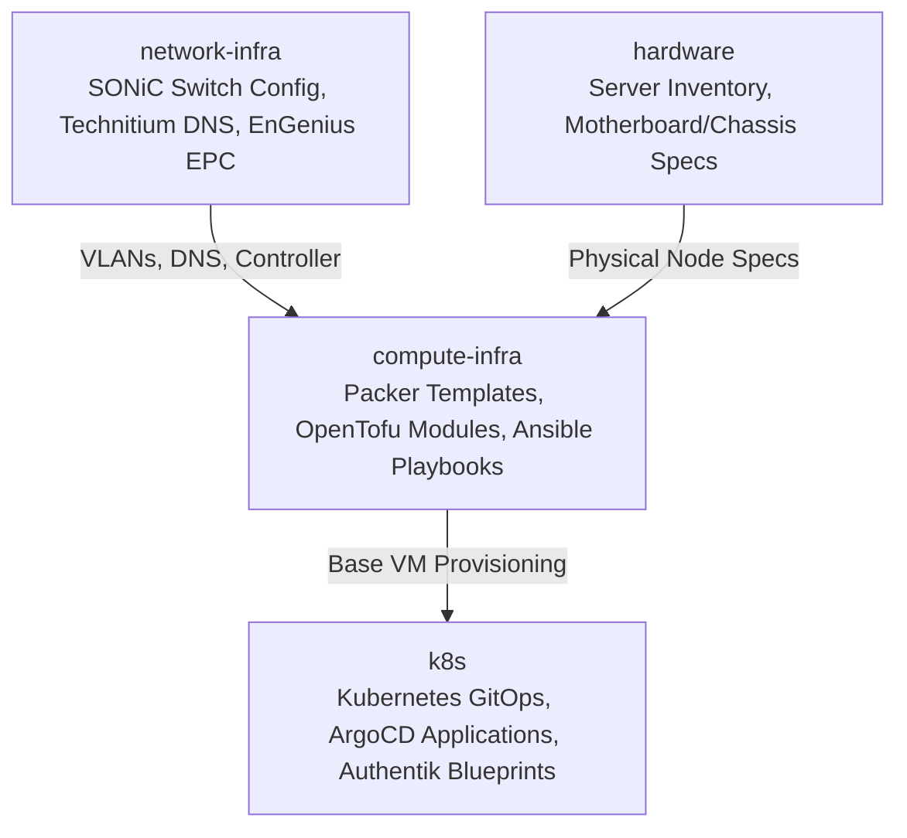

# Infrastructure Architecture & Repository Decomposition

## Overview

Following the infrastructure refactoring of 2026-09-03, this monolithic repository (`homelab-gitops`) has been decomposed into three focused repositories aligned with physical and operational lifecycles:

## Repository Roles

1. **`compute-infra` (`/home/dev/repos/compute-infra`)**:
   - **Packer**: Builds hardened Ubuntu and VMware Photon OS golden images.
   - **OpenTofu**: Declares virtual machine configurations across Proxmox / vSphere.
   - **Ansible**: Manages post-boot OS hardening, UFW firewall, Docker runtimes, and Grafana Alloy monitoring agents.

2. **`network-infra` (`/home/dev/repos/network-infra`)**:
   - **Enterprise SONiC**: Dell PowerSwitch N3224T-ON configuration files, VLAN segmentation, and port channel management.
   - **Technitium DNS & DHCP**: Declarative DNS zone management, forwarding rules, and client lease mappings.
   - **EnGenius EPC**: Controller configuration and containerized appliance lifecycle.

3. **`k8s` (`/home/dev/repos/k8s`)**:
   - Manages Kubernetes cluster resources via ArgoCD GitOps.
   - Authentik SSO and forward-auth configurations.
   - Core platform services (Prometheus Stack, Cert-Manager, External-Secrets, Rook-Ceph).
